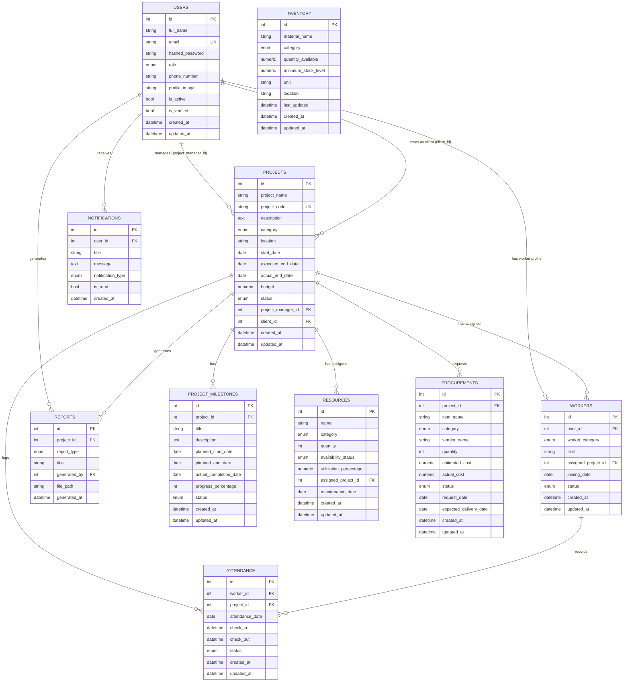

# BuildTrack — Database Schema

Milestone 1 creates the complete initial schema for the platform (10 tables). Only `users`
and `projects` (read-only) are exercised by Milestone 1 endpoints; the remaining tables are
in place so later milestones can build directly on top of them without further migrations.

## Entity-Relationship Diagram



## Tables

### users
Primary key: `id`. Unique: `email`. Indexed: `id`, `email`, `role`.
Every authenticated principal — regardless of role — is a row in this table.

### projects
Primary key: `id`. Unique: `project_code`. Foreign keys: `project_manager_id → users.id`
(`ON DELETE SET NULL`), `client_id → users.id` (`ON DELETE SET NULL`).

### project_milestones
Primary key: `id`. Foreign key: `project_id → projects.id` (`ON DELETE CASCADE`).

### resources
Primary key: `id`. Foreign key: `assigned_project_id → projects.id` (`ON DELETE SET NULL`).

### inventory
Primary key: `id`. Standalone stock table (no foreign keys in Milestone 1).

### workers
Primary key: `id`. Foreign keys: `user_id → users.id` (unique, `ON DELETE CASCADE` — one
worker profile per user), `assigned_project_id → projects.id` (`ON DELETE SET NULL`).

### attendance
Primary key: `id`. Foreign keys: `worker_id → workers.id` (`ON DELETE CASCADE`),
`project_id → projects.id` (`ON DELETE CASCADE`).

### procurements
Primary key: `id`. Foreign key: `project_id → projects.id` (`ON DELETE CASCADE`).

### notifications
Primary key: `id`. Foreign key: `user_id → users.id` (`ON DELETE CASCADE`).

### reports
Primary key: `id`. Foreign keys: `project_id → projects.id` (`ON DELETE CASCADE`),
`generated_by → users.id` (`ON DELETE SET NULL`).

## Enumerations

| Enum | Values |
|---|---|
| `UserRole` | `ADMIN`, `PROJECT_MANAGER`, `SITE_ENGINEER`, `CONTRACTOR`, `WORKER`, `CLIENT` |
| `ProjectCategory` | `RESIDENTIAL`, `COMMERCIAL`, `INDUSTRIAL`, `INFRASTRUCTURE`, `GOVERNMENT` |
| `ProjectStatus` | `PLANNED`, `IN_PROGRESS`, `ON_HOLD`, `COMPLETED`, `CANCELLED` |
| `MilestoneStatus` | `NOT_STARTED`, `IN_PROGRESS`, `COMPLETED`, `DELAYED` |
| `ResourceCategory` | `EXCAVATORS`, `CONCRETE_MIXERS`, `CRANES`, `DUMP_TRUCKS`, `GENERATORS`, `SAFETY_EQUIPMENT` |
| `AvailabilityStatus` | `AVAILABLE`, `IN_USE`, `UNDER_MAINTENANCE`, `OUT_OF_SERVICE` |
| `MaterialCategory` | `CEMENT`, `STEEL`, `BRICKS`, `SAND`, `CONCRETE`, `ELECTRICAL_MATERIALS`, `PLUMBING_MATERIALS` |
| `WorkerCategory` | `ENGINEERS`, `SUPERVISORS`, `CONTRACTORS`, `SKILLED_WORKERS`, `UNSKILLED_WORKERS`, `CONSULTANTS` |
| `WorkerStatus` | `ACTIVE`, `ON_LEAVE`, `RELEASED` |
| `AttendanceStatus` | `PRESENT`, `ABSENT`, `HALF_DAY`, `ON_LEAVE` |
| `ProcurementCategory` | `RAW_MATERIALS`, `EQUIPMENT`, `MACHINERY`, `SAFETY_EQUIPMENT`, `OFFICE_SUPPLIES` |
| `ProcurementStatus` | `REQUESTED`, `APPROVED`, `ORDERED`, `DELIVERED`, `REJECTED` |
| `NotificationType` | `INFO`, `WARNING`, `ALERT`, `SUCCESS` |
| `ReportType` | `PROGRESS`, `FINANCIAL`, `RESOURCE`, `SAFETY`, `CUSTOM` |

## Migrations

The full schema is created by a single Alembic migration:
`backend/alembic/versions/0001_initial_schema.py`. Run it with:

```bash
alembic upgrade head
```
