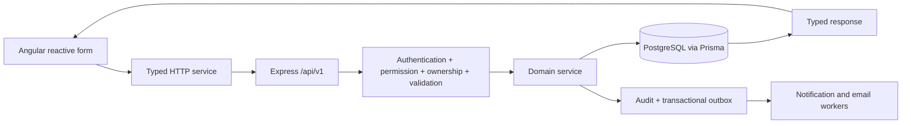

# BuildTrack proposed architecture

Status: design proposal for the supplied master specification. No feature is claimed implemented by this document. The user selected Desktop/Infosys; the foundation is now implemented there. This document still describes the full target architecture; README.md distinguishes implemented features from future phases.

## System and frontend

Angular standalone components and lazy feature routes communicate with one modular Express API. PostgreSQL is the source of truth; Prisma manages database access and versioned migrations. A modular monolith keeps cross-module transactions practical without premature distributed services.

```text
frontend/
  src/app/
    core/{auth,guards,interceptors,services,models}/
    shared/{components,directives,pipes,tables,charts}/
    layout/{app-shell,sidebar,topbar}/
    features/{auth,dashboard,projects,site-monitoring,resources,inventory,
              workforce,procurement,finance,reports,documents,notifications,
              admin,settings}/
  src/styles/{tokens,typography,utilities}.scss
  public/images/
backend/
  prisma/{schema.prisma,migrations,seed.ts}
  src/
    config/
    middleware/
    shared/{errors,http,authorization,events,storage,mail}/
    modules/{auth,users,organizations,projects,site-progress,resources,
             inventory,workforce,procurement,finance,notifications,reports,
             documents,analytics,audit}/
    app.ts
    server.ts
  tests/{unit,integration}/
packages/contracts/
e2e/
infrastructure/{docker,nginx,scripts}/
docs/
.github/workflows/
```

This is a target layout, not an instruction to move existing files wholesale. During migration, preserve old application locations and introduce the replacement backend alongside them.

Use typed services, reactive forms, shared UI primitives, and explicit loading/empty/error/forbidden states. Store sidebar preference locally, but do not trust browser role storage. Read actual permissions from the server. Debounce search, cancel stale requests, preserve filters on paging, and fetch only permitted records.

Design tokens follow the provided navy `#0D1B2A`, orange `#F97316`, background `#F5F7FA`, white surface, and semantic status colors. Use Inter/Manrope, a 4/8/12/16/24/32 spacing rhythm, 6-12px radii, accessible focus styles, mobile drawer, and reusable responsive cards/tables. Monetary values and dates must not wrap mid-value.

## Backend and API

Each module separates route/controller, Zod schema, service, data access where useful, and tests. Services own workflow transitions, transactions, authorization scope, and audit/event production. Controllers do not contain business calculations.



Base `/api/v1`; Swagger at `/api/docs`. Resources follow the master list: auth, users, projects, project milestones, site-progress, site-activities, delays, inspections, resources, resource-allocations, maintenance, inventory, material-requests, material-allocations, workers, attendance, shifts, vendors, procurement, purchase-orders, invoices, budgets, expenses, notifications, reports, documents, analytics, audit-logs.

Success: `{success:true,message,data}`. Paginated lists additionally provide `meta:{page,limit,total,totalPages}`. Errors: `{success:false,message,errors}` with safe field-level details. Bound pagination, allowlist sortable/filterable fields, use typed decimals, reject unexpected privilege fields, and sanitize unexpected errors. Include request IDs in logs without logging credentials/tokens.

## Authentication and authorization

- Validate environment config at startup; no fallback production secrets.
- Hash passwords with a maintained bcrypt/Argon2 implementation. Public registration never assigns privileged roles or joins an arbitrary company by its name.
- Proposed public registration default: isolated organization with client role, or invitation-based membership. Organization onboarding policy remains open.
- Short-lived JWT access token in memory; refresh credential in an HTTP-only, SameSite cookie, Secure in production. Store only hashed refresh credentials, rotate on refresh, revoke on logout/reset, detect replay, and explicitly test concurrent refresh behavior.
- JWT checks include algorithm allowlist, issuer, audience, expiry, active account and valid session. Role changes take effect from server state.
- Reset requests return a uniform response. Persist a hashed, expiring, one-time reset credential; deliver through SMTP or a local development mail sink. Never expose it through a public API response.
- Origin restrictions and CSRF protection for cookie-authenticated mutations; rate-limit auth endpoints. Apply Helmet, request limits, safe error handling, and audit records.
- Permission checks are necessary but insufficient: all business queries must include organization and assigned-project scope. Clients receive an explicitly limited projection. Workers access their own work/attendance data.

### Proposed permission matrix

All access is within the user's organization. `Assigned` means current project membership; `Own` means the user's record. This is a documented default to validate, not a hidden rule.

| Capability                          | Administrator | Project manager             | Site engineer          | Contractor                         | Worker                  | Client                         |
| ----------------------------------- | ------------- | --------------------------- | ---------------------- | ---------------------------------- | ----------------------- | ------------------------------ |
| Users, roles, organization settings | Manage        | No                          | No                     | No                                 | No                      | No                             |
| Projects                            | Manage        | Create; manage assigned     | Read assigned          | Read assigned                      | Read assigned work      | Read assigned, approved fields |
| Milestones                          | Manage        | Manage assigned             | Update assigned        | Read assigned                      | Read own tasks          | Read approved                  |
| Site reports, activities, delays    | Manage        | Manage assigned             | Create/update assigned | Submit assigned                    | Own task updates        | Approved updates only          |
| Resources and allocation            | Manage        | Manage assigned             | Allocate assigned      | Read assigned                      | Own assignments         | No                             |
| Inventory and material requests     | Manage        | Review/allocate assigned    | Request/use assigned   | Request assigned                   | No                      | No                             |
| Workforce, attendance, shifts       | Manage        | Manage assigned             | Record assigned        | Assigned workforce; scoped updates | Own attendance/shift    | No                             |
| Procurement and POs                 | Manage        | Review/create assigned      | Request assigned       | Request assigned                   | No                      | No                             |
| Finance                             | Manage        | Manage assigned             | No                     | No                                 | No                      | Approved high-level summary    |
| Documents/reports                   | Manage        | Manage assigned             | Operational assigned   | Operational assigned               | Own permitted documents | Explicitly published only      |
| Notifications/profile               | Own           | Own                         | Own                    | Own                                | Own                     | Own                            |
| Audit logs                          | Organization  | Assigned operational subset | No                     | No                                 | No                      | No                             |

Model permission codes centrally. Administrative authority remains organization-scoped, never an implicit cross-tenant bypass. Finance/procurement/supervisor duties in the demo workflow map to permissions on these six roles; do not silently add roles.

## Proposed database schema

UUID PKs, timestamptz created/updated timestamps, organization ownership, foreign-key indexes, and status/date indexes on applicable entities. Monetary fields use decimal precision and an explicit currency. No floating-point money. Archive records where history matters.

| Domain          | Tables and key relationships                                                                                                                                                                                                                                                |
| --------------- | --------------------------------------------------------------------------------------------------------------------------------------------------------------------------------------------------------------------------------------------------------------------------- |
| Identity        | organizations; users -> organization/role; roles; permissions; role_permissions; auth_sessions -> user; password_reset_tokens -> user                                                                                                                                       |
| Projects        | projects -> organization/manager/client; project_members -> project/user; project_milestones -> project/responsible user; milestone_dependencies; tasks -> project/milestone/assignee                                                                                       |
| Site            | site_progress_reports -> project/engineer; report_material_usage; report_resource_usage; site_activity_logs; delays -> project/task or milestone; inspections -> project/inspector; safety_issues -> inspection/project                                                     |
| Resources       | resources -> organization; resource_allocations -> resource/project/operator; resource_maintenance -> resource; resource_usage -> allocation                                                                                                                                |
| Inventory       | inventory_items -> organization/vendor/location; stock_movements -> item/project/source; material_requests -> project/requester; material_request_items -> request/item; material_allocations -> request item/project                                                       |
| Workforce       | workers -> organization/user optional; worker_allocations -> worker/project; attendance -> worker/project/date; shifts -> project/supervisor; shift_assignments -> shift/worker; payroll_periods; payroll_entries -> period/worker                                          |
| Procurement     | vendors; procurement_requests -> project/requester; procurement_request_items -> request; procurement_approvals; purchase_orders -> vendor/project/request; purchase_order_items -> PO; goods_receipts -> PO; goods_receipt_items -> receipt/PO item; invoices -> PO/vendor |
| Finance         | budgets -> project/currency; budget_items -> budget/category; expenses -> project/category/vendor/source; optional expense_attachments                                                                                                                                      |
| Reporting/files | reports -> project/creator/storage metadata/filter snapshot; documents -> project/category/visibility; document_versions -> document/storage key/uploader                                                                                                                   |
| System          | notifications -> recipient/entity; notification_preferences; audit_logs -> actor/entity; outbox_events; organization_settings                                                                                                                                               |
| Integrations    | cameras -> project/provider/stream config; weather_cache -> project/location/provider/observation time                                                                                                                                                                      |

Uniqueness: normalized organization/email policy, project membership pair, organization/SKU, organization/employee code, attendance business key, organization/PO number, document/version. Checks: nonnegative quantities, positive transaction quantities, progress 0-100, valid date ranges. Reject cross-organization references using scoped lookups and compound constraints where feasible.

Resource reservation and stock allocation require a transaction with conditional updates/locks. Preserve movement/allocation history and reverse with explicit release records. Receiving uses an idempotency key to prevent duplicate stock updates. PO totals, taxes, receipts, and budget commitments must derive from validated line items and documented accounting rules.

## Module dependencies

Auth/organization/permissions precede every business module. Projects/memberships precede site, allocation, procurement, finance, files, and client visibility. Vendors and inventory precede purchasing/receiving. Attendance/shift data precede payroll estimates. Finance and operational data precede analytics/reports. Audit and outbox primitives are introduced early so business actions do not need retrospective instrumentation.

## Notifications, storage, and reporting

Persist events in an outbox in the same transaction as domain changes. A worker handles in-app notifications and retryable SMTP delivery. Socket.IO, if enabled, publishes to authenticated user/organization rooms and never substitutes for persisted state. Add scheduled deadline/stock/budget evaluation after their source modules exist.

StorageService exposes upload/download/delete/getSignedUrl. Local files live outside public static roots. Validate extension, MIME/signature, size, and authorization. Use generated keys, signed short-lived URLs or protected streaming, project visibility rules, and immutable version records. Add configured S3/Cloudinary adapters without changing domain services.

Reports execute the same scoped queries as the application, persist selected filters and generation history, and produce real PDF/XLSX files. Exports must prevent spreadsheet formula injection. Financial columns require finance permissions independently of report permissions. Large exports use background jobs with bounded resource use.

## Deployment and verification

Build Angular into a static bundle behind Nginx; proxy API routes to Express. Use PostgreSQL with migrations run as a separate controlled step. Development Compose includes frontend, API, PostgreSQL, and optionally a local mail sink. Docker availability must be checked before claiming this runs locally.

CI: reproducible install, type checks/builds, lint, unit tests, PostgreSQL integration tests, Angular tests, and Playwright flows. Test unauthorized/forbidden/cross-project/cross-organization access, concurrent allocations, replayed reset/refresh tokens, upload limits, and idempotent receipt processing. Configure health/readiness, graceful shutdown, secrets, backups, storage, and TLS for production. No production-ready claim until these are verified.
