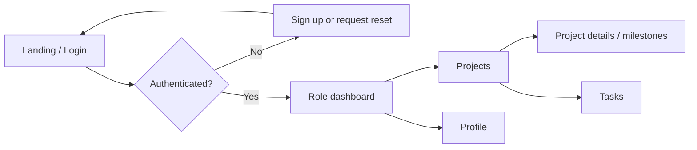

# BuildTrack - Milestone 1 design baseline

## Scope and user roles

BuildTrack centralizes construction project coordination, site progress, resources, materials, workforce, procurement, budgets and reports. The initial release uses these roles:

| Role | Primary access |
| --- | --- |
| Administrator | Users, roles, system monitoring and all project records |
| Project Manager | Projects, milestones, schedules, tasks and team coordination |
| Site Engineer | Assigned projects, site progress and technical task updates |
| Contractor | Assigned work packages and updates |
| Worker | Assigned tasks and attendance |
| Client | Read-only project status, milestones and reports |

## Functional requirements

1. Users can sign up, sign in, reset a password and view/update their profile.
2. JWT bearer tokens protect API requests; role checks protect privileged actions.
3. The application stores the schema required for projects, milestones, resources, inventory, workforce, procurement, notifications and reports.
4. The web client is responsive and gives each authenticated role an appropriate dashboard entry point.

## Non-functional requirements

- Passwords are hashed; reset tokens are hashed, one-time, and expire after 30 minutes.
- API validation returns clear client errors and only the configured frontend origin may call the API.
- The UI supports current desktop and mobile browsers, and uses accessible labels and error messages.
- PostgreSQL is the production database; Alembic controls schema changes.

## Navigation and user flow

## Wireframe inventory

| Screen | Essential content | Primary action |
| --- | --- | --- |
| Login | Email, password, reset link | Sign in |
| Registration | Name, email, role, password | Create account |
| Reset password | Email, then token and new password | Reset password |
| Administrator dashboard | User count, project health, alerts | Manage users |
| Project manager dashboard | Project progress, milestones, tasks | Open project |
| Site engineer dashboard | Assigned site work and daily progress | Update task |
| Contractor dashboard | Assigned work packages | Submit update |
| Client dashboard | Read-only milestones and reports | View report |
| Project list/details | Status, schedule, manager, milestones | Create/edit project |

## Database design

`users` is the identity table. `projects` belongs to a manager; `tasks` and `project_milestones` belong to projects. `workers` optionally links to a user, and `attendance` belongs to a worker. `procurements` and `reports` may link to a project. `notifications` belong to a user. `resources` and `inventory` are shared catalogues. Password-reset tokens are stored separately from user credentials.
